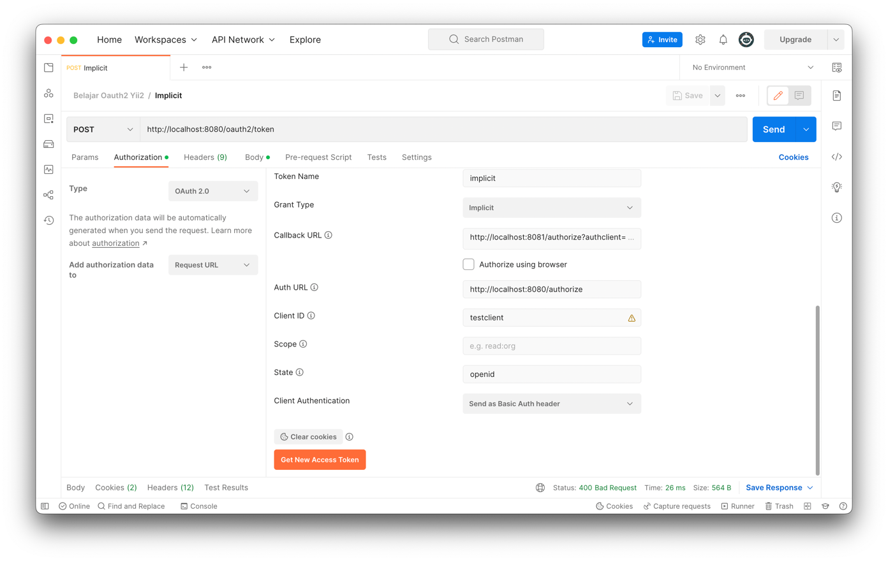

<p align="center">
    <a href="https://github.com/yiisoft" target="_blank">
        
    </a>
    <h1 align="center">Yii 2 Basic + Yii2 Admin + Yii2 OAuth2 Server</h1>
    <br>
</p>

Repository ini dibangun menggunakan framework Yii2 untuk keperluan OAuth2 Server dengan bahan dasar:

1. https://github.com/yiisoft/yii2-app-basic
2. https://github.com/filsh/yii2-oauth2-server
3. https://github.com/mdmsoft/yii2-admin

Untuk client nya juga menggunakan Yii2 di repository
ini: [Yii2 Auth Client](https://github.com/ahmadfadlydziljalal/yii2-oauth2-client)

<hr>

Untuk lebih mudah memahami OAuth2, tulisan [ini](https://rizkimufrizal.github.io/belajar-oauth2) cukup membantu.

Jangan lupa generate Pair Key di mesin atau server Anda:

```

# Pindah ke direktori storage
$ cd app/storage

# private key
$ openssl genrsa -out privkey.pem 2048

# public key
$ openssl rsa -in privkey.pem -pubout -out pubkey.pem
```

Implementasi nya pada masing-masing grant_type sebagai berikut:

<p>Langkah memulai deployment</p>

1. Clone Project,
2. Running composer update,
3. Rename `config/db-example.php` menjadi `config/db.php`
4. Running migration,
   1. `php yii migrate-rbac`
   2. `php yii migrate-mdm`
   3. `php yii migrate-filsh`
   4. `php yii migrate`
5. Running server dengan mengetikkan perintah `php yii serve localhost:8080`
6. Aplikasi siap digunakan

```
Login Info
Username : Admin
Password : Admin123
```

## Grant Type: Authorization Code

Flow: nya

1. Mulai dengan niat,
2. User click url pada halaman client: http://localhost:8081/authorize?authclient=my-oauth2
3. PopUp terbuka, tampilkan halaman login Auth Server, http://localhost:8080/authorize
4. Username dan password cocok, diteruskan ke callback client, http://localhost:8081/authorize?authclient=my-oauth2
5. Dari dalam callback: Client menukarkan authorization_code menjadi token ke Auth Server
   melalui http://localhost:8080/oauth2/token
6. Masih di dalam callback: Token didapatkan, request lagi user-info melalui http://localhost:8080/oauth2/user-info
7. Set url return nya, misal ke halaman index, seperti `Yii::$app->user->returnUrl = Url::to(['index']);`
8. Mapping user-info ke sistem user client.
9. Selesai

Cara testing nya menggunakan Postman:


Kalau mau testing proses penukaran code menjadi token, berikut langkahnya:

1. Pada `SiteController::actionAuthorize` ubah `return $this->redirect($location);` ke `return $location;`
2. Test lagi pakai postman seperti pada gambar sebelumnya. Jika login berhasil, response yang ditampilkan berupa string.
   
3. Copy isi queryParams code, kemudian jadikan sebagai value dari parameter `code` pada request baru dengan postman pada
   url request: http://localhost:8080/oauth2/token
   

## Resource Owned Password

Bisa digunakan untuk client yang secara credential dipercaya, seperti untuk aplikasi client yang dibangun sendiri.
Pengujian bisa dilakukan di postman sebagai berikut.


## Client Credentials

Bisa digunakan untuk mengidentifikasi client saja tanpa melibatkan resource owner. Pengujian bisa dilakuka di postman
sebagai berikut


## Refresh Token

Seperti yang kita tahu sebelumnya access token mempunyai batas kadaluarsa, maka dalam waktu tertentu access token perlu
di refresh. Dengan refresh token kita tidak perlu melakukan authorization kembali untuk mendapatkan access_token yang
baru.


## Implicit

Sama seperti authorization code, bedanya tidak ada penukaran code ke token


## AUthorization Code With PKCE

Belum di support sama library ini.
